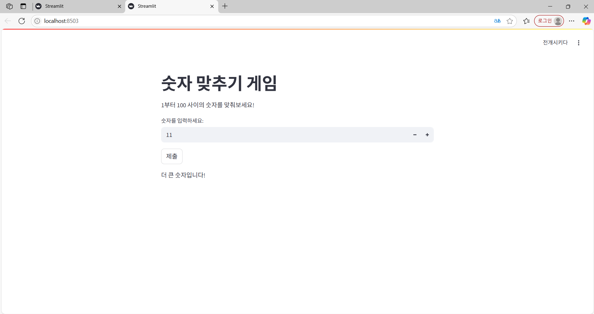

# 🎮 숫자 맞추기 게임 (Number Guessing Game) - WebAppSample

Python + Streamlit 기반의 **숫자 맞추기 게임** 예제 프로젝트입니다.  
1부터 100까지의 랜덤 숫자를 맞추는 게임으로, **Streamlit 웹 앱** 형태로 실행됩니다.

👉 Azure Web App 배포도 고려하여 `.deployment` 및 `.vscode` 설정 파일이 포함되어 있습니다.

---

## 📦 사용 기술

- Python 3.x
- Streamlit
- Visual Studio Code (with Azure extension)
- Azure App Service (배포 시 사용 가능)

---

## 📁 프로젝트 구조

```
WebAppSample/
├── app.py # 숫자 맞추기 게임 Streamlit 앱
├── requirements.txt # 필수 패키지 리스트
├── .deployment # Azure 배포 설정 파일
└── .vscode/settings.json # VSCode 배포/환경 설정
```

---

## 🚀 실행 방법 (로컬 실행)

### 1️⃣ 가상환경 생성 (선택)

```bash
python -m venv .venv
.\.venv\Scripts\activate    # Windows
# source .venv/bin/activate # Mac/Linux
```
### 2️⃣ 필수 패키지 설치
```
pip install -r requirements.txt
```
## 3️⃣ Streamlit 앱 실행
```
streamlit run app.py
```
→ 브라우저에서 자동으로 http://localhost:8501 실행됨.


실행화면

---

## ⚙️ Azure Web App 배포 (선택)
.deployment 파일과 .vscode/settings.json 구성 포함됨 → VS Code → Azure App Service 확장으로 쉽게 배포 가능.

VSCode에서 Deploy to Web App 실행 시 .deployment 및 .vscode/settings.json 설정이 적용됨.

👉 참고: .vscode/settings.json 에 기본 ignore 패턴 설정 적용 → .venv, __pycache__, .env 등 불필요한 파일은 배포 제외됨

---


## 🎮 게임 설명
게임 목표: 1부터 100까지의 랜덤 숫자 맞추기.

Streamlit 앱 UI로 입력 및 결과 확인.

시도 횟수 (attempts) 를 화면에 표시.

숫자를 맞추면 자동으로 새 게임 시작.

---


## ✅ 주요 기능
Streamlit 기반 웹 UI 제공.

Session state 로 시도 횟수 및 게임 상태 유지.

성공 시 자동 초기화 기능.

Azure App Service 배포 고려 구조 포함.

---


## ⭐️ Author
JIYOUNG KWON
GitHub: kwonji0597


